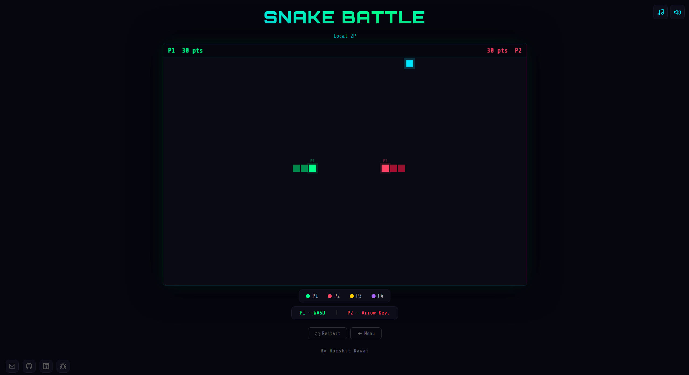
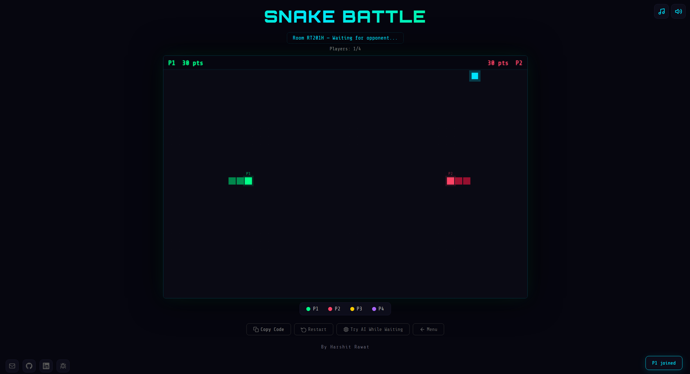
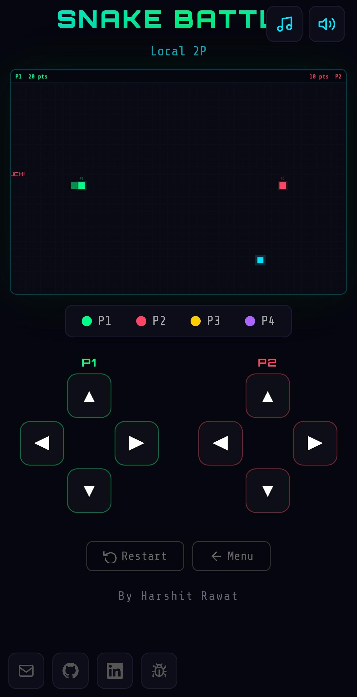
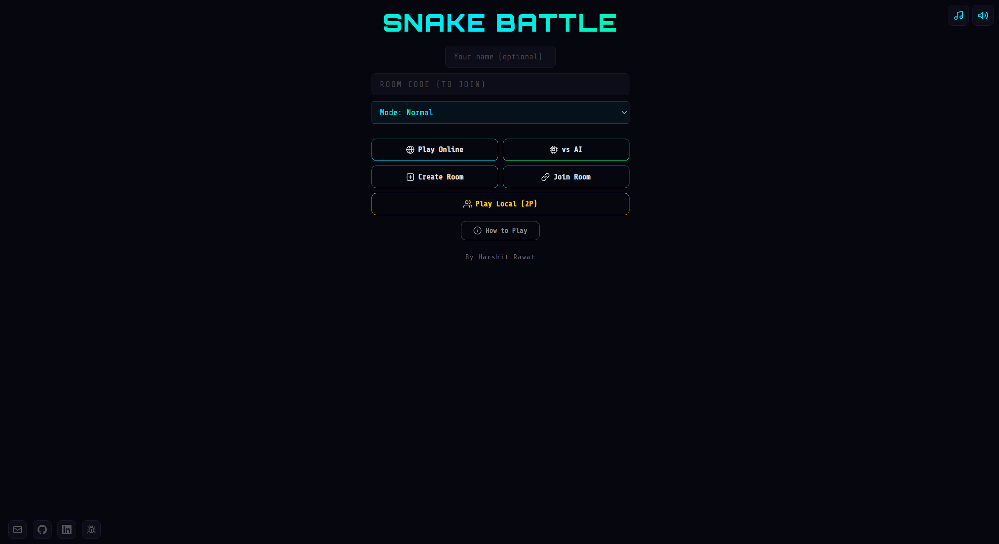

# 🐍 Snake Battle

A **production-ready real-time multiplayer Snake game** built using **JavaScript and Firebase**, featuring matchmaking, private rooms, AI opponent, multiple game modes, and cross-device gameplay.

---

## 🚀 Live Demo

👉 https://snake-battle-e986b.web.app

---

## 📸 Screenshots

### 🎮 Gameplay


### 🌐 Multiplayer


### 📱 Mobile Controls


### 🏠 Menu


---

## 🎮 Features

### 🌐 Multiplayer System

* Real-time multiplayer using Firebase Realtime Database
* Public matchmaking + private room system
* Cross-device gameplay (PC + Mobile)
* Smooth game state synchronization

### 👥 Multi-Player Support

* Supports up to **4 players** in a single game
* Dynamic player join/leave handling
* Unique colors and player identity

### 🤖 AI Opponent

* Smart AI with adaptive behavior
* Pathfinding-based movement logic
* Multiple difficulty levels

### ⚔️ Game Modes

* **Normal Mode** – Classic gameplay
* **Sudden Death** – Increasing difficulty / shrinking arena
* **Last Man Standing** – Survival-based winner system

### ⚡ Power-Ups

* Speed Boost
* Shield
* Double Damage
* Double Points

Each power-up lasts for a limited duration and affects gameplay dynamically.

### 📱 Mobile Support

* Responsive canvas
* Touch controls + on-screen buttons
* Swipe support for movement
* Optimized layout for smaller screens

### 🔊 Sound System

* Background music
* Event-based sound effects
* Toggle sound controls

### 🎨 Visual Effects

* Damage indicators
* Screen flash effects
* Animated grid background
* Smooth rendering using Canvas

---

## 🛠️ Tech Stack

* **JavaScript (ES6)**
* **HTML5 Canvas**
* **CSS3**
* **Firebase Realtime Database**
* **Web Audio API**

---

## 🧠 Key Concepts Implemented

* Real-time multiplayer synchronization
* Event-driven architecture
* Game loop optimization
* Collision detection and damage system
* State management across clients
* Matchmaking and room management

---

## 📂 Project Structure

```
snake-web/
│
├── public/
│   ├── index.html
│   ├── game.js
│
├── firebase.json
├── database.rules.json
├── .firebaserc
└── README.md
```

---

## ⚙️ Setup & Run Locally

```bash
git clone https://github.com/ROGHET/snake-battle.git
cd snake-battle
```

Then open:

```
public/index.html
```

in your browser.

---

## 🏆 Future Improvements

* Global persistent leaderboard
* Advanced matchmaking algorithm
* Player progression system (XP / levels)
* More power-ups and game modes
* Large-scale multiplayer support

---

## 👨‍💻 Author

**Harshit Rawat**

---

## ⭐ Support

If you like this project, consider giving it a ⭐ on GitHub!

